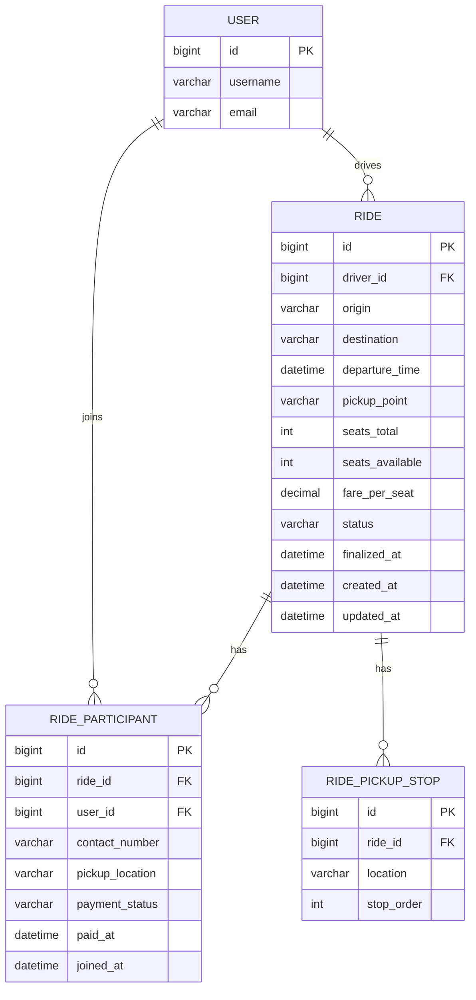

# Database Entities and Relationships

This project uses MySQL with Django ORM models in `rides/models.py` plus Django's built-in `auth_user` table.

## ER Diagram (Logical)



## Relationship Diagram (Cardinality View)

```text
auth_user (1) --------< (many) rides_ride
     |                         |
     |                         +--------< (many) rides_ridepickupstop
     |
     +--------< (many) rides_rideparticipant >-------- (1) rides_ride
```

## Constraints and Keys

- `rides_ride.driver_id -> auth_user.id` (`ForeignKey`, `CASCADE`).
- `rides_rideparticipant.ride_id -> rides_ride.id` (`ForeignKey`, `CASCADE`).
- `rides_rideparticipant.user_id -> auth_user.id` (`ForeignKey`, `CASCADE`).
- `rides_ridepickupstop.ride_id -> rides_ride.id` (`ForeignKey`, `CASCADE`).
- Unique constraint on `rides_rideparticipant(ride_id, user_id)`.
- Unique constraint on `rides_ridepickupstop(ride_id, stop_order)`.

## Table Mapping (Django default names)

- `Ride` -> `rides_ride`
- `RideParticipant` -> `rides_rideparticipant`
- `RidePickupStop` -> `rides_ridepickupstop`
- `User` (Django auth) -> `auth_user`
